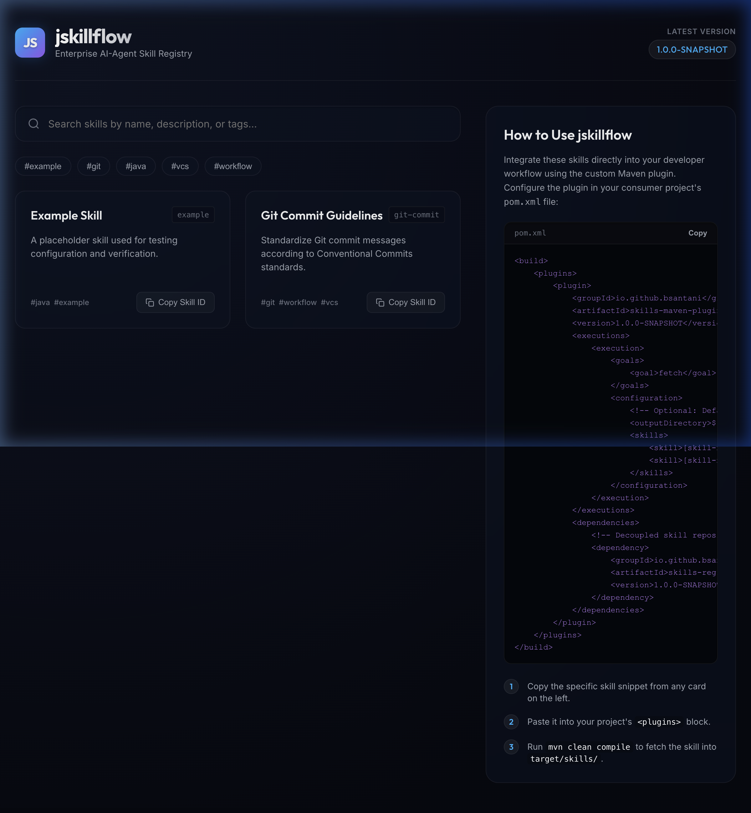
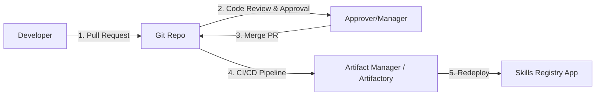

# JSkillflow

**JSkillflow** is a lightweight, developer-friendly registry and distribution framework designed for managing, discovering, and delivering **AI-Agent Skills** (prompts, tool schemas, code snippets, and config files) within enterprise JVM environments.



---

## The Problem JSkillflow Solves
In modern enterprise applications, AI agents require versioned, validated "skills" to perform tasks. Managing these assets (like system prompts, Python tools, or JSON schemas) across multiple backend services and team borders is highly challenging. 

Many modern agent frameworks are Python-centric, leaving the Java enterprise ecosystem (Spring Boot, Quarkus, Micronaut) without a native, zero-friction integration.

**JSkillflow solves this by:**
1. **Treating Skills as Versioned Maven Artifacts**: Packaged on the classpath, skills are distributed, versioned, and cached using the enterprise's existing Maven repository infrastructure (e.g., Nexus or Artifactory).
2. **Providing a Custom Maven Plugin**: Developers declare dependencies on the skills they need in their `pom.xml`, and the plugin automatically fetches and extracts those assets into the project's target directories during the compile lifecycle.
3. **Offering a Sleek Developer Portal**: A lightweight registry UI for visual discovery, tag-filtering, search, and copying configuration snippets.

---

## Target Audience
*   **Enterprise Java/JVM Developers** building AI-agent architectures who want zero-friction prompt and tool integration.
*   **Platform & DevOps Teams** wanting a simple, lightweight way to distribute agent assets without managing heavy databases or complicated new API infrastructures.
*   **AI & Prompt Engineers** who need a clean dashboard to organize, tag, and publish validated skills for backend teams to consume.

---

## Project Architecture
The project is a monorepo consisting of three lightweight modules:

1.  **`skills-registry` (Backend)**:
    A lightweight Java application powered by [Javalin 7](https://javalin.io) that serves the skill catalog (`registry.json`) and hosts the static UI.
2.  **`skills-ui` (Frontend)**:
    A modern, high-performance [Angular](https://angular.dev) single-page application built with CSS grids, vibrant HSL gradients, glassmorphism aesthetics, and instant filtering (by text search or tags).
3.  **`skills-maven-plugin` (Maven Integration)**:
    A custom Maven plugin with goals to `list` and `fetch` skill assets during the build phase. It supports extracting resources directly from standard local directories or zipped JAR archives on the classpath.

---

## Governance & Approvals (GitOps Workflow)
JSkillflow is designed to run internally within an enterprise. Instead of writing custom login screens, authentication layers, or user role databases, it enforces contribution and approval policies using standard corporate **Git workflows**:



1.  **Contribution**: A developer adds or modifies a skill by opening a **Pull Request (PR)** against the JSkillflow source repository.
2.  **Approval**: Designated "Skill Owners" review and approve the PR using existing repository governance rules (e.g. GitHub/GitLab branch protection).
3.  **Deployment**: Once merged, your standard CI/CD pipeline automatically compiles the project, publishes the updated JAR, and restarts the self-hosted JSkillflow container.
4.  **Audit Trail**: Git history provides a complete, compliant audit trail showing exactly who contributed a skill, who approved it, and when it went live.

---

## Creating & Structuring Skills

To add a new skill to the registry, create a directory under `skills-registry/src/main/resources/skills/[skill-id]/` with the following structure:

```text
skills-registry/src/main/resources/skills/[skill-id]/
├── metadata.json
├── SKILL.md
├── example-usage.md
└── code-snippets/
    └── prompt.txt
```

### 1. The `metadata.json` File
The metadata file must contain strictly the following properties (`name`, `description`, `tags`):
```json
{
  "name": "Git Commit Generator",
  "description": "Generates a semantic git commit message based on diff changes.",
  "tags": ["git", "vcs", "openai"]
}
```
*Note: Any additional keys will trigger a validation error during build execution to prevent metadata pollution.*

### 2. Auto-Aggregation & Versioning
When the project compiles (`mvn clean install` or the `generate-resources` phase of `skills-registry`), a build-time script:
1. Dynamically reads the project version from the root `pom.xml` and assigns it to all skill configurations.
2. Validates the `metadata.json` structure for strict compliance.
3. Automatically compiles all skill metadata records into `public/registry.json` for consumption by the Angular frontend.

---

## Getting Started

### Prerequisites
*   Java 17 or higher
*   Maven 3.9+
*   Node.js (for UI development)

---

### Running the Registry Locally

1.  **Build the Entire Project**:
    Run a clean build from the root directory to compile the Java modules, install Angular dependencies, and bundle the UI:
    ```bash
    mvn clean install
    ```
    *Note: The Angular tests and Maven plugin tests run automatically during this phase.*

2.  **Start the Server**:
    Run the registry backend using the Maven exec plugin:
    ```bash
    mvn exec:java -pl skills-registry -Dexec.mainClass="io.github.bksantani.registry.RegistryApp"
    ```
    Once started, open your browser and navigate to:
    `http://localhost:8080`

---

### Consuming Skills in a Java Project

To consume skills in your JVM backend project, configure the `skills-maven-plugin` inside your project's `pom.xml`. 

To allow the **plugin execution code** and the **actual skill templates** to evolve independently, you can declare the `skills-registry` dependency directly inside the plugin configuration block. This allows you to bump the registry version frequently to pull new skills, without ever needing to update the core plugin version:

```xml
<build>
    <plugins>
        <plugin>
            <groupId>io.github.bksantani</groupId>
            <artifactId>skills-maven-plugin</artifactId>
            <version>1.0.0-SNAPSHOT</version> <!-- Static plugin binary version -->
            <executions>
                <execution>
                    <goals>
                        <goal>fetch</goal>
                    </goals>
                    <configuration>
                        <!-- Optional: Specify where to output the fetched skills -->
                        <!-- Defaults to ${project.build.directory}/skills -->
                        <outputDirectory>${project.build.directory}/skills</outputDirectory>
                        <skills>
                            <!-- List the specific skill IDs you want to pull -->
                            <skill>git-commit</skill>
                            <skill>example</skill>
                        </skills>
                    </configuration>
                </execution>
            </executions>
            <dependencies>
                <!-- Decoupled skill repository containing your actual prompt files -->
                <dependency>
                    <groupId>io.github.bksantani</groupId>
                    <artifactId>skills-registry</artifactId>
                    <version>1.0.0-SNAPSHOT</version> <!-- Bushed when skills change -->
                </dependency>
            </dependencies>
        </plugin>
    </plugins>
</build>
```

When you run `mvn clean compile` in your project, the plugin fetches the declared skills and extracts them into:
`target/skills/[skill-id]/`

---

## Running the Test Suite
To run both the Java and Angular test suites, run the following command from the root directory:
```bash
mvn test
```

To run only the Angular UI tests, navigate to the `skills-ui` directory and run:
```bash
npm test
```

---

## Licensing

This project is licensed under the [Apache License 2.0](LICENSE.md).

